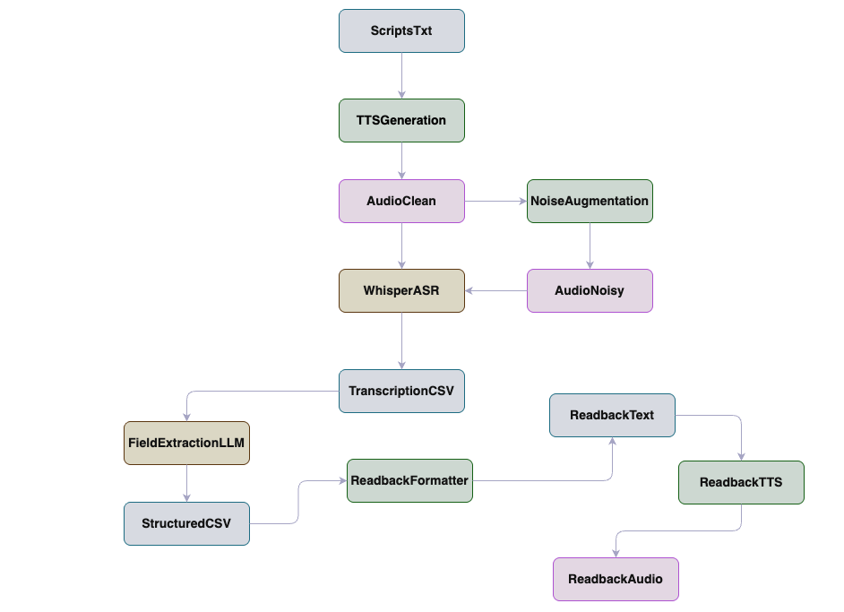

## A Voice Pipeline Demo

This repository contains a small, end-to-end **voice assistant pipeline** inspired by a startup ML Engineer role.  
It turns **scripted sales visits** into synthetic audio, adds realistic noise, runs **ASR + LLM-based extraction**, and
finally synthesizes a **spoken “readback” summary** of the meeting.

The goal is to demonstrate:

- **Robust speech processing** under different noise conditions (clean, slight_noise, heavy_noise).
- **Model evaluation & trade-offs** (WER, keyword accuracy, Whisper model sizes).
- **End-to-end assistant behavior**: from raw speech → structured fields → a spoken recap that is useful in a workflow.

---

## 1. Pipeline overview

End-to-end flow:

1. **Scripted dialogs → TTS (clean audio)**  
   - `src/tts/generate_audio.py`  
   - Uses ElevenLabs TTS with two voices (salesperson + client) to turn text scripts into MP3s:
     - Input: `data/scripts/scripts_final.txt`  
     - Output: `data/audio_clean/script_X_clean.mp3`

2. **Clean audio → noisy audio (robustness data)**  
   - `src/noise/augment.py`  
   - Mixes clean audio with MUSAN noise at two levels:
     - Input: `data/audio_clean/*.mp3`, `data/musan/noise/**/*.wav`  
     - Output:  
       - `data/audio_noisy/script_X_slight_noise.mp3`  
       - `data/audio_noisy/script_X_heavy_noise.mp3`

3. **Audio → ASR + metrics (Whisper)**  
   - `src/asr/transcribe.py`  
   - Transcribes clean + noisy audio using Whisper and computes:
     - **WER** vs full transcript.
     - **Keyword accuracy** vs a keyword list.
   - Input: `data/audio_clean`, `data/audio_noisy`, `data/ground_truth/ground_truth.json`  
   - Output:
     - `results/transcription_results.csv`  
     - Printed summary by audio type (clean / slight_noise / heavy_noise).

4. **Transcripts → structured fields (Ollama LLM)**  
   - `src/extraction/extract_fields.py`  
   - Sends each ASR hypothesis to a local Ollama model (default `llama3.1:8b`) to extract:
     - `deal_status`, `sentiment`, `follow_up_date`, `client_concern`, `action_items`  
   - Compares predictions to ground truth with exact + fuzzy metrics and computes **overall accuracy**.
   - Input: `results/transcription_results.csv`, `data/ground_truth/ground_truth.json`  
   - Output:  
     - `results/extraction_results_few_shot_fuzz_2.csv`  
     - Printed summary by audio type.

5. **Fields → spoken summaries (readback text)**  
   - `src/tts_readback/format_fields.py`  
   - Converts predicted JSON fields into natural, spoken-language summaries such as:  
     “Deal status is closed and won. Overall sentiment is positive. Follow-up is scheduled for Thursday…”
   - Input: `results/extraction_results_few_shot_fuzz_2.csv`  
   - Output: `results/readback_formatted.csv`

6. **Summaries → readback audio (TTS)**  
   - `src/tts_readback/synthesize_readback.py`  
   - Uses ElevenLabs TTS (salesperson voice) to synthesize a **readback MP3** for each (script, audio_type):  
     - `script_X_clean_readback.mp3`  
     - `script_X_slight_noise_readback.mp3`  
     - `script_X_heavy_noise_readback.mp3`
   - Input: `results/readback_formatted.csv` (or regenerates from extraction results)  
   - Output:
     - `data/audio_readback/*_readback.mp3`  
     - `results/readback_synthesis_log.csv`

High-level diagram:



---

## 2. Environment setup

1. **Create and activate a virtual environment**

```bash
python -m venv .venv
source .venv/bin/activate  # on macOS/Linux
# .venv\Scripts\activate   # on Windows
```

2. **Install Python dependencies**

```bash
pip install -r requirements.txt
```

   Run all commands from the **repository root**. Use `python -m src.<module>` so the `src` package is found.

3. **Configure ElevenLabs**

- Sign up for ElevenLabs and obtain API keys.
- Set the following environment variables (or add them to a local `.env` file that is not committed to git):
  - `eleven_labs_api_key`
  - `sales_paul` (voice ID for salesperson)
  - `client_rachel` (voice ID for client)

4. **Configure Ollama**

- Install Ollama from their website and ensure the daemon is running.
- Pull the model used by the extraction script:

```bash
ollama pull llama3.1:8b
```

5. **Data layout**

- Conversation scripts: `data/scripts/scripts_final.txt`
- Ground truth labels: `data/ground_truth/ground_truth.json`
- MUSAN noise: `data/musan/noise/**/*.wav`
- Generated artifacts:
  - Clean audio: `data/audio_clean/*.mp3`
  - Noisy audio: `data/audio_noisy/*.mp3`
  - Readback audio: `data/audio_readback/*_readback.mp3`
  - CSV results: `results/*.csv`

---

## 3. Unified demo CLI (`src/main_demo.py`)

For interview/demo use, there is a small orchestrator:

- `src/main_demo`

It provides modes:

- `full` – Run the entire pipeline: TTS → noise → ASR → extraction → readback.
- `asr_only` – Only ASR + evaluation on existing audio files.
- `extraction_only` – Only LLM extraction on existing transcription CSV.
- `readback_only` – Only formatting + readback TTS on existing extraction results.

It also supports:

- `--fast-demo` – Use a **smaller Whisper model** and **limit the number of files** so the demo runs quickly.

### Examples

- **Full pipeline, small subset**

```bash
python -m src.main_demo --mode full --fast-demo
```

- **Only ASR + metrics on existing audio**

```bash
python -m src.main_demo --mode asr_only --fast-demo
```

- **Only LLM extraction (assumes `transcription_results.csv` exists)**

```bash
python -m src.main_demo --mode extraction_only
```

- **Only readback synthesis (assumes extraction results exist)**

```bash
python -m src.main_demo --mode readback_only
```

The orchestrator performs friendly **environment and data checks**:

- Verifies ElevenLabs env vars before running TTS stages.
- Verifies Ollama is reachable and the model is pulled before extraction.
- Verifies that expected data files (scripts, ground truth, intermediate CSVs) exist before each mode runs.

---

## 4. ASR robustness experiment (`whisper_model_comparison.py`)

To explicitly talk about model trade-offs, there is a small experiment script:

- `src/experiments/whisper_model_comparison.py`

It:

- Runs multiple Whisper model sizes (default: `tiny`, `small`, `medium`) on the **same subset** of clean + noisy audio.
- Reuses the same metrics as the main ASR pipeline (WER + keyword accuracy).
- Prints a table of average metrics per `(model_size, audio_type)`.

Example:

```bash
python -m src.experiments.whisper_model_comparison --models tiny small medium --max-files 6
```
---

